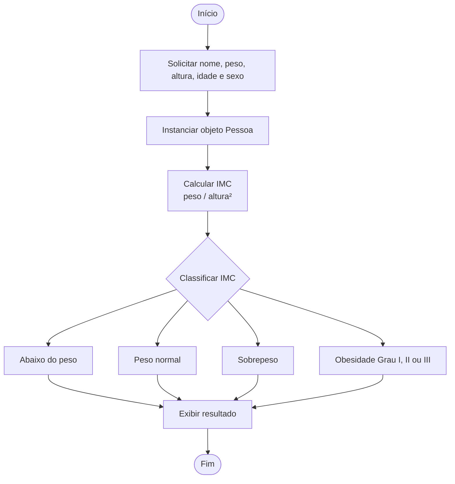

# 📊 Calculadora de IMC

Projeto simples desenvolvido para praticar os fundamentos de **Programação Orientada a Objetos (POO)** em C#.

> ⚠️ Este é um projeto de estudo. O objetivo não é ser uma aplicação completa, mas sim fixar conceitos como classes, enums, separação de responsabilidades e boas práticas de código.

---

## 🧠 Conceitos praticados

- Classes e propriedades (`Pessoa`, `CalculadoraImc`)
- Enumeradores (`CategoriaImc`, `Sexo`)
- Separação de responsabilidades (Models / Services)
- Switch expression (C# 9+)
- Construtores
- Namespaces

---

## 📁 Estrutura do projeto

```
CalculadoraIMC/
├── src/
│   ├── Models/
│   │   └── Pessoa.cs         # Dados do usuário
│   ├── Services/
│   │   └── CalculadoraImc.cs # Lógica de cálculo e classificação
│   └── Program.cs            # Entrada de dados e exibição
└── README.md
```

---

## 🔄 Fluxo da aplicação



---

## ▶️ Como rodar

**Pré-requisitos:** .NET SDK instalado

```bash
git clone https://github.com/seu-usuario/CalculadoraIMC.git
cd CalculadoraIMC
dotnet run
```

---

## 📌 Melhorias futuras

- [ ] Validação de entrada com `TryParse`
- [ ] Salvar histórico em arquivo `.json`
- [ ] Testes unitários

---

## 🛠️ Tecnologias

- C# / .NET
- Programação Orientada a Objetos
